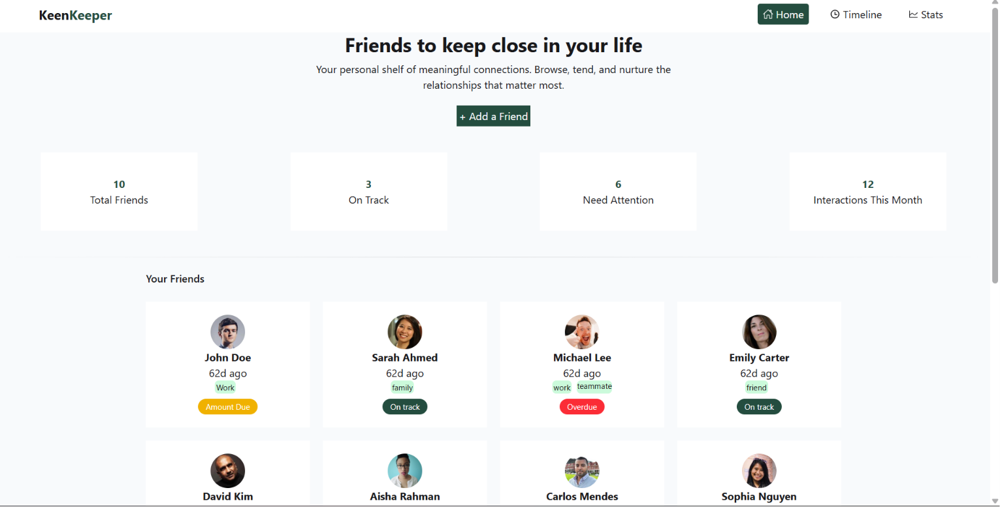

# 🌟 KeenKeeper

KeenKeeper is a modern web application designed to keep friends and family connected in today’s busy world. It helps you maintain meaningful relationships through simple, intuitive interactions and thoughtful features.

## 📸 Project Preview

## 🔗 Live Project
[View Live Demo](https://keen-keeper-7.vercel.app/)

---

## 📖 Description
In a world that never slows down, **KeenKeeper** acts as a personal relationship manager. It provides an intuitive interface to manage groups, schedule interactions, and stay updated with your circle. Whether you are managing family gatherings or keeping track of friends, KeenKeeper makes it effortless.

## ✨ Core Features
*   **Real-time Interaction:** Stay connected with chat and status updates.
*   **Group Management:** Easily organize friends & family into specific groups.
*   **Smart Reminders:** Get notified to stay in touch with those who matter most.
*   **Dynamic Timeline:** Easily sort and view your interaction history.
*   **Customizable UI:** Clean, responsive design with Dark Mode support.
*   **Mobile-First:** Fully optimized for on-the-go usage.

## 🛠 Tech Stack
*   **Frontend:** React, Next.js (Routing)
*   **Styling:** Tailwind CSS, DaisyUI
*   **Icons:** React Icons
*   **Deployment:** Vercel

## 📦 Dependencies
To run this project, you will need the following dependencies installed:
*   `react`
*   `next`
*   `tailwindcss`
*   `daisyui`
*   `react-icons`

## 🚀 How to Run Locally

Follow these steps to set up the project on your machine:

1. **Clone the repository:**
   ```bash
   git clone [https://github.com/KANOK508/Ph-A7-Assignment-keeper.git](https://github.com/KANOK508/Ph-A7-Assignment-keeper.git)
   cd Ph-A7-Assignment-keeper
